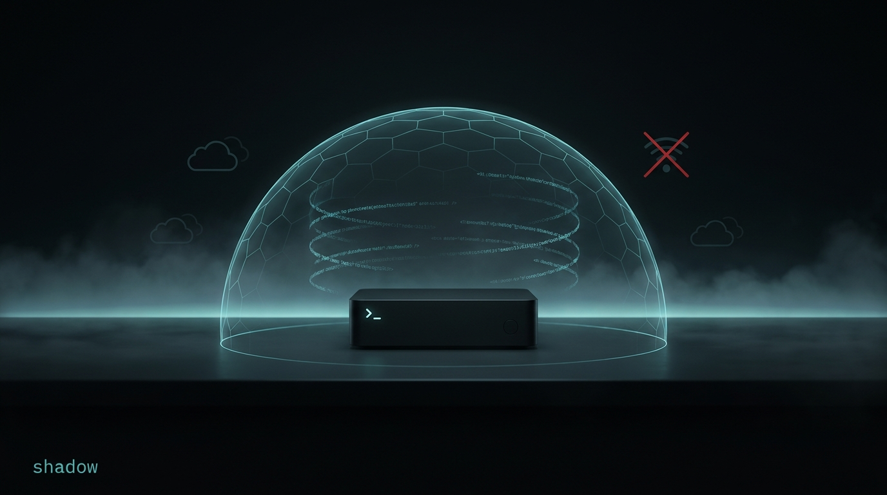

<p align="center">
  
</p>

# Shadow

> **A true gift of freedom and privacy.**
> Zero-telemetry · provider-neutral · phone home to no one.
> Your models, your hardware, your rules.

**Shadow is a zero-telemetry, provider-neutral coding agent that runs on your terms.** Point it at any model — Anthropic, any OpenAI-compatible endpoint, Gemini, or a local model on your own box — and it works as a coding / sysadmin agent over your workspace. **No Shadow account, no signup, no phone-home:** the only outbound traffic is the provider *you* chose and the web tools the agent explicitly invokes. Your config stays local and readable (`~/.shadow/config.json`), your keys never leave your machine, and you can switch models mid-session **without losing context**.

We're not competing for "coding-tool" mindshare — we're handing you back control: local-first autonomy, real guardrails, and full ownership of your workspace and your data.

Under the hood it's a **tool-calling agentic runtime**: the model reasons, emits tool calls, Shadow executes them against the OS through a bounded, observable loop with a configurable permission model and enforced guardrails (workspace jail + OS sandbox), and loops until the task is done or a stop condition fires.

This is **not a chat app** — it is a tool-calling runtime.

## Status

| Milestone | What | State |
|---|---|---|
| M0 | Skeleton, config, provider-neutral block model, mock provider, headless loop (termination + budget), approval gate, REPL | ✅ |
| M1 | Tools: `read_file` `write_file` `edit_file` `grep` `glob` `run_shell` (zod-validated, structured results) | ✅ |
| M2 | Safety: symlink-aware workspace jail, catastrophic-command denylist, autonomy levels, approval flow, dry-run, SSRF netguard | ✅ |
| M3 | Ink TUI HUD (streaming output / status bar / inline approval dialog / two-stage Ctrl-C) | ✅ |
| M4 | Append-only redacted session logs + project-facts memory (`memory` tool) | ✅ |
| M5 | Real providers (Anthropic + OpenAI-compatible, streaming, prompt caching, retry), web tools | ✅ |
| M6 | Claude Code harness parity: plan/ask/export, approval taxonomy, fallback, permission rules, hooks, MCP/skills/agent | ✅ |
| M7 | **Format-adaptive universality** — dual transport + auto-detect, text-tool-call recovery, control-token scrub, three tool-call signature regimes (Anthropic signed / Gemini `thought_signature` / plain OpenAI); validated against a 9-model test program | 🚧 |

Per-version detail lives in **[CHANGELOG.md](CHANGELOG.md)**.

## Install

Shadow ships as a single self-contained binary (no Node needed to run it). The installer is served from **this GitHub repo** so its pinned signing key can't be swapped by the download host.

### macOS / Linux

```bash
curl -fsSL https://raw.githubusercontent.com/Blackfrost-AI/Shadow_CLI/main/install.sh | sh
```

### Windows (PowerShell)

```powershell
irm https://raw.githubusercontent.com/Blackfrost-AI/Shadow_CLI/main/install.ps1 | iex
```

The installer detects your platform, downloads the matching binary, **verifies it** (see below), and drops it on your `PATH`. **Update:** `shadow update`. **Uninstall:** delete the binary (`rm "$(command -v shadow)"`).

### Verifying the download 🔒

Shadow is a security tool, so the installer **fails closed**. It downloads `SHASUMS256.txt` plus an ECDSA‑P256 signature (`SHASUMS256.txt.sig`) made with an **offline** release key, verifies that signature against the public key **pinned in the installer**, and only then checks the binary's SHA‑256 against the signed manifest. A compromised download host can't forge the signature, so a tampered binary is rejected — the install aborts. (Signature verification uses `openssl` on macOS/Linux and PowerShell 7+ on Windows; Windows PowerShell 5.1 falls back to the checksum with a warning.) The release public key is [`public/bin/SHASUMS256.pub`](https://shadow.redpillreader.com/bin/SHASUMS256.pub) and is embedded in `install.sh`/`install.ps1` — read them before piping to a shell.

### Build from source (optional)

Requires **Node.js ≥ 20** and **git**:

```bash
git clone https://github.com/Blackfrost-AI/Shadow_CLI.git && cd Shadow_CLI && npm install && npm run build && npm link
```

Then `shadow --help` from anywhere.

## First run — connect your model

A fresh install ships with **no provider configured** — Shadow won't run until you connect one. Just launch it:

```bash
shadow
```

On first run it opens a guided menu: pick a provider (Anthropic, OpenAI, OpenRouter, Groq, DeepSeek, Mistral, xAI, Gemini, Together, Ollama, LM Studio, or a custom endpoint), paste your API key (masked as you type), choose a model, and Shadow runs a **live connection test** before saving. Type `back` or `b` at any onboarding prompt to return to the previous step without restarting. Re-run it anytime to switch:

```bash
shadow onboard          # change provider / model / key
```

Your choice is saved per-machine to `~/.shadow/` — `config.json` (provider + model) and `credentials.json` (key/token, `chmod 600`). **Nothing is committed to the repo; every machine sets up its own.** Environment variables (`ANTHROPIC_API_KEY`, `ANTHROPIC_BASE_URL`, `OPENAI_API_KEY`, …) and CLI flags still override the saved config, so CI and scripted runs can stay key-in-env. In a non-interactive context (`--task`, piped, no TTY) with nothing configured, Shadow exits with `Run \`shadow onboard\` to set one up` instead of hanging.

## Quickstart

```bash
shadow                                   # interactive HUD in the current directory
shadow --task "fix the failing tests"    # one-shot, scriptable
shadow --yolo --task "build the app"     # fully autonomous — no prompts (see Autonomy)
shadow --provider mock --task hi         # no API key needed (deterministic mock)
shadow export                            # export latest session to exports/*.md
```

### Session export

Export the current (or a past) conversation as readable markdown:

```bash
/export                    # in the TUI — writes <workspace>/exports/shadow-<timestamp>.md
/export reports/run.md     # optional output path (resolved within the workspace)
shadow export              # CLI — latest session in cwd
shadow export --session .shadow/sessions/<file>.jsonl --out reports/run.md
```

Source of truth is the append-only session log (`.shadow/sessions/*.jsonl`), not the TUI render cache.

## Run from source

```bash
npm install
npm run typecheck && npm run lint && npm test   # all green

# Interactive (TTY) — launches the Ink HUD:
ANTHROPIC_API_KEY=sk-ant-... npm run dev -- --system ./prompts/SHADOW.md --autonomy auto-edit

# One-shot, non-interactive (plain renderer, scriptable):
ANTHROPIC_API_KEY=sk-ant-... npm run dev -- --task "add a test for parseConfig and run it"

# No API key needed — deterministic mock provider:
npm run dev -- --provider mock --task "scan repo"

# Build a runnable binary:
npm run build && node dist/index.js --help   # or link `shadow` via package.json bin
```

`npm run dev` runs the TypeScript entry directly via `tsx`; `npm run build` compiles to `dist/`.

## CLI flags

```
--system <path>      external system-prompt markdown
--autonomy <level>   manual | auto-read | auto-edit | full      (default auto-edit)
--provider <name>    anthropic | openai | mock
--model <id>         model id (default claude-opus-4-8)
--base-url <url>     override provider base URL (also ANTHROPIC_BASE_URL / OPENAI_BASE_URL)
--max-output-tokens <n>  per-call output cap (raise for verbose "thinking" models)
--max-iterations <n>     loop iteration cap (default 200; raise for big multi-file tasks)
--context-budget <n>     token budget before summarization (default 128000)
--max-wall-sec <n>       wall-clock ceiling in seconds (safety stop for long autonomous runs)
--workspace <path>   workspace root (default cwd) — all file paths resolve under this
--style <name>       proactive | explanatory | learning | procedural
--plan-mode          start in explore/plan mode before implementation
--dry-run            write/exec tools become no-ops that report what they WOULD do
--task "<text>"      run a single task non-interactively and exit (plain renderer)
--repl               force the plain REPL even in a TTY (skip the Ink HUD)
--yolo               bypass ALL permission checks (autonomy=full, auto-approve
                     everything incl. denylisted, never ask). Aliases: --nuke,
                     --dangerously-skip-permissions
--log-level <l>      silent | error | info | debug
-v, --version        print version
-h, --help           show this help
```

## Autonomy levels

Set with `--autonomy` (or `SHADOW_AUTONOMY`), toggle mid-session in the HUD with **Shift+Tab**.

| Level | Behavior |
|---|---|
| `manual` | confirm **every** tool call |
| `auto-read` | auto-approve read/search/glob; confirm write/exec/network |
| `auto-edit` *(default)* | auto-approve reads + writes inside the workspace; confirm exec/network |
| `full` | auto-approve everything **except** denylisted/destructive ops, which are always confirmed |

A catastrophic shell command (`rm -rf /`, `mkfs`, `dd of=/dev/…`, fork bombs, `chmod -R 777 /`, …) triggers an explicit confirmation **regardless of level** — even at `full`. The list is extendable via `denylistExtra` in config.

**`--yolo`** (aliases `--nuke`, `--dangerously-skip-permissions`) is the explicit sandbox-off + guardrails-off flag: forces `full` autonomy, auto-approves everything (incl. denylist), grants root to bypass workspace jail, and disables OS sandbox for run_shell (writes anywhere OS allows). Prints warning. Use only on trusted/throwaway envs. --no-sandbox is lower-level for just disabling the shell sandbox while keeping other guards.

**Non-interactive runs (`--task`)** have no human to ask, so anything that *would* reach the approval gate is **denied** (and fed back to the model as a recoverable error) rather than run blindly. Capability is therefore set entirely by `--autonomy`: use `--autonomy full` to let the agent run shell/network unattended; a denylisted command is still refused, never executed. This makes `--task` safe to script and to run in CI.

### Agent behavior

Shadow's system prompt (`prompts/SHADOW.md`, or the built-in default) instructs the driven model to **keep the workspace organized** — files go in logical subdirectories (`src/`, `tests/`, `docs/`, `plans/`, `research/`), not dumped in the root, and scratch is cleaned up — and to **persist its thinking as markdown**: a short `plans/<name>.md` before multi-step work (checked off as it goes), and `research/<topic>.md` for findings with concrete references. Substantial deliverables are written as files, not buried in chat. Point `--system` at your own prompt to override.

## Keybindings (interactive HUD)

| Key | Action |
|---|---|
| `Ctrl-C` (1st, while running) | graceful stop — abort the in-flight tool/turn |
| `Ctrl-C` (2nd, or when idle) | quit |
| `Shift+Tab` / `Tab` | cycle autonomy level (applies live to a running loop) |
| `←` / `→` | move the caret within the composer (edit mid-line) |
| `↑` / `↓` | input history |
| `Esc` | abort the running task, or clear the composer when idle |
| `\` + `Enter` | insert a newline in the composer (multiline prompt) |
| `Ctrl-O` | toggle collapse of the latest reasoning block (when idle) |
| `Enter` while running | interrupt the active turn and queue the typed text as the next prompt |
| `y` / `n` / `a` | in a permission dialog: approve / deny / always (approve + raise autonomy) |
| `s` / `f` | in a permission dialog: approve for session / approve shell command prefix |
| `1`–`9` / `Enter` | in an `ask_user_question` dialog: pick an option / confirm (Esc to skip) |

### Slash commands

Type `/` in the composer to open a command menu (with descriptions). Filter by
typing (`/cl` → `/clear`), `↑`/`↓` to select, `Tab` to autocomplete, `Enter` to run,
`Esc` to dismiss.

| Command | Action |
|---|---|
| `/help` | show keybindings and the command list |
| `/clear` | clear the screen and reset the conversation |
| `/model` | switch between configured models (picker when multiple) |
| `/style` | cycle output style |
| `/autonomy` | cycle the autonomy level |
| `/fast` | toggle Anthropic fast mode (lower latency; next turn) |
| `/compact` | summarize earlier turns to free context |
| `/cost` / `/usage` | show session token usage and cost |
| `/context` | show context-window usage |
| `/export` | export the session to markdown (optional path) |
| `/resume` | resume a prior session (optional session id/path) |
| `/rewind` | rewind to a turn index (e.g. `/rewind 2`) |
| `/init` | scaffold `SHADOW.md` in the workspace |
| `/agents` | list agent definitions |
| `/memory` | show project memory facts |
| `/permissions` | list or edit permission rules |
| `/doctor` | diagnose environment, credentials, and guardrails |
| `/quit` | exit Shadow |

While the agent is running, informational commands (`/help`, `/cost`, `/usage`, `/context`, `/fast`) work without interrupting the turn.

## Configuration

📖 **New here?** The [**User Guide**](USER_GUIDE.md) is the task-oriented walkthrough — connecting a model, tuning output length, reasoning effort, autonomy, and troubleshooting.

Layered precedence: **CLI flags > env > `shadow.config.json` > defaults**, validated with zod (fails fast with a readable message). `maxOutputTokens` (the per-call output cap) defaults to **`65536`** so reasoning models don't hit the cap before answering — change it per-run with `--max-output-tokens <n>`, live with `/config set maxOutputTokens <n>`, or permanently in the config file ([details](USER_GUIDE.md#output-length-maxoutputtokens)). Example `shadow.config.json`:

```json
{
  "provider": "anthropic",
  "model": "claude-opus-4-8",
  "autonomy": "auto-edit",
  "maxIterations": 25,
  "maxOutputTokens": 65536,
  "contextBudget": 100000,
  "maxToolResultChars": 16384,
  "shellEnvAllowlist": ["PATH", "HOME", "USER", "LANG", "TERM", "TMPDIR", "SHELL"],
  "denylistExtra": [],
  "fallbackModel": "claude-sonnet-4-6",
  "parallelTools": true,
  "permissionRules": [
    { "tool": "run_shell", "pattern": "rm -rf", "action": "ask" }
  ],
  "hooks": {
    "pre_tool_use": ["scripts/pre-hook.sh"],
    "post_tool_use": []
  },
  "mcpServers": {
    "example": { "command": "npx", "args": ["-y", "some-mcp-server"] }
  },
  "models": [
    { "label": "opus", "provider": "anthropic", "model": "claude-opus-4-8", "fallback": "claude-sonnet-4-6" },
    { "label": "sonnet", "provider": "anthropic", "model": "claude-sonnet-4-6", "disabled": false }
  ],
  "budget": { "maxTotalTokens": 2000000, "maxCostUSD": 5, "maxWallClockSec": 1800 },
  "priceTable": {
    "claude-opus-4-8":   { "input": 5, "output": 25, "cacheReadMult": 0.1, "cacheWriteMult": 1.25 },
    "claude-sonnet-4-6": { "input": 3, "output": 15 },
    "claude-haiku-4-5":  { "input": 1, "output": 5 }
  }
}
```

The loop always terminates — on natural completion, the iteration cap (`maxIterations`), a budget ceiling (`maxTotalTokens` / `maxCostUSD` / `maxWallClockSec`), or Ctrl-C — and never hangs silently on a provider error (retryable errors back off and surface; 400/401/403 surface immediately).

### Claude Code harness parity

Shadow implements the same tool/mode contracts as Claude Code so Anthropic models (and compatible endpoints) run without feature surprises. See [`plans/claude-parity.md`](plans/claude-parity.md) for the full build spec.

| Capability | Shadow tool / surface |
|---|---|
| Enter plan mode | `enter_plan_mode` (user must approve) + `Shift+Tab` / `--plan-mode` |
| Write plan | `plan_write` |
| Exit plan mode | `exit_plan_mode` (separate approval kind from permissions) |
| Structured questions | `ask_user_question` (numbered options in TUI/REPL) |
| Session export | `/export`, `shadow export` |
| Model fallback | `fallbackModel` + per-model `fallback` / `disabled` in `models[]`; one auto-retry per session on 529/overloaded |
| Permission rules | `permissionRules`: per-tool `deny` / `ask` / `allow` with optional regex on preview |
| Hooks | `hooks.pre_tool_use` / `post_tool_use` — shell scripts, JSON on stdin; non-zero pre-hook denies |
| Live shell output | `shell_output` bus events (TUI + headless renderer) |
| Sub-agents | `agent` tool (isolated context sub-loop) |
| Scheduled wakeups | `schedule_wakeup` (in-session timer → queued prompt) |
| MCP | `mcpServers` in config (stdio or HTTP) → tools registered as `mcp_<server>_<name>` |
| Fast mode | `--fast` / `/fast` / `SHADOW_FAST=1` — Anthropic low-latency path |
| Extended cache | `cacheTtl: "1h"` / `SHADOW_CACHE_TTL=1h` — prompt cache breakpoints |
| Multi-root | `--add-dir` / `additionalDirectories` — widen jail + shell sandbox |
| Background shells | `run_in_background`, `bash_output`, `kill_shell` tools |
| Multi-edit | `multi_edit` — atomic multi-hunk file edits |
| Skills tool | `skill` — invoke bundled skill scripts |
| Skills | `skills/<name>/SKILL.md` or `.shadow/skills/` — indexed in system prompt |
| Parallel tools | `parallelTools` (default on; sequential during plan mode / gate tools) |

### Scaling to your hardware

Shadow's limits are tunable, not hard-coded — on a self-hosted model where tokens are free and the context window is large, dial them up to match the box. For an ambitious multi-file build:

```bash
shadow --task "<big task>" --autonomy full \
  --max-iterations 40 --max-output-tokens 24000 --context-budget 200000 --max-wall-sec 1800
```

`--max-iterations` raises the turn cap (default 200 suits most tasks; a multi-file build with a test→fix loop wants more); `--context-budget` is how many tokens accumulate before summarization kicks in (a self-hosted model with a 256K window rarely needs to summarize at all); `--max-wall-sec` is a wall-clock safety stop so a long autonomous run still terminates. The termination guarantee is preserved at every setting — you can always raise the ceilings, but there is always *a* ceiling (and Ctrl-C).

API keys are read from the environment only: `ANTHROPIC_API_KEY`, `OPENAI_API_KEY`.

### Custom & self-hosted endpoints

Both providers accept a base-URL override (`--base-url`, or `ANTHROPIC_BASE_URL` / `OPENAI_BASE_URL` / `baseUrl` in config). The Anthropic provider also accepts a bearer token via `ANTHROPIC_AUTH_TOKEN` (which takes precedence over `x-api-key`) — so Shadow is a drop-in against any Anthropic-Messages-compatible endpoint, including a local **Ollama** server:

```bash
ANTHROPIC_BASE_URL=http://your-host:11434 ANTHROPIC_AUTH_TOKEN=ollama ANTHROPIC_API_KEY="" \
  npm run dev -- --provider anthropic --model <your-model> --autonomy auto-edit
```

This has been verified end to end (multi-step `read_file`→`write_file` tool calling, plus larger multi-file builds) against a self-hosted Ollama model. Note: smaller "thinking" models emit verbose reasoning that Shadow discards — give them generous `maxOutputTokens` so the budget isn't consumed before the tool call. OpenAI-compatible endpoints (e.g. Ollama's `/v1`) work the same way via `--provider openai --base-url http://your-host:11434/v1`.

### Local `.gguf` files — auto-served

> **Requires [llama.cpp](https://github.com/ggml-org/llama.cpp)** — Shadow *launches and manages* the server for you, but the `llama-server` binary must be installed. Install it with `brew install llama.cpp` (macOS/Linux) or build from source, or point Shadow at an existing binary via `ggufServer` / `$SHADOW_LLAMA_SERVER`. When it's missing, `shadow local add`/`test` offers to install it for you.

Point a model entry at a local `.gguf` and Shadow starts a `llama.cpp` server for it on activation (and shuts it down on exit), then talks to it over the OpenAI endpoint — no Ollama/LM Studio process to run:

```jsonc
"models": [
  {
    "label": "my-model (local)",
    "provider": "openai",          // ignored for gguf entries; routed to the local server
    "model": "my-model",
    "gguf": "/opt/models/my-model-Q8_0.gguf",
    // optional:
    "ggufPort": 8123,              // default: a deterministic per-path port
    "ggufArgs": ["-ngl", "999", "-c", "32768", "--jinja"],  // default shown
    "ggufServer": "/usr/local/bin/llama-server"             // default: PATH or $SHADOW_LLAMA_SERVER
  }
]
```

Pick it from `/model` (or set it as the default) and Shadow serves it locally — first load shows a "loading the model into memory" note. An already-running server on the same port is reused. The context budget is capped under the server's `-c` automatically.

## Model compatibility — tested models

Shadow is **format-adaptive, not capability-guaranteed**. It speaks both the Anthropic Messages and OpenAI-Chat wire formats, recovers tool calls a model emits as plain text, scrubs leaked control tokens, and round-trips all three tool-call signature regimes (Anthropic signed thinking, Gemini `thought_signature`, plain OpenAI). What it **can't** do is make a weak model capable or turn a chat model into an agent. The rule of thumb: **Shadow is for agentic, tool-calling models, run over the wire format they were trained for.**

Shadow works with **any agentic, tool-calling model** — cloud frontier models (Claude, GPT, Gemini) or capable local models served over an OpenAI- or Anthropic-compatible endpoint (Ollama, LM Studio, llama.cpp, vLLM). The harness is model-neutral: it recovers tool calls emitted as plain text, scrubs stray control tokens, and round-trips all three tool-call signature regimes (Anthropic signed thinking, Gemini `thought_signature`, plain OpenAI), so a broad range of models drive the loop well.

**Picking a local model:**

- Use an **instruct / tool-calling** build, not a base or chat-only model — a chat model narrates but never calls a tool.
- **Match the wire format to the model.** Most local models speak OpenAI-Chat; a few are trained to emit Anthropic-format calls and should be routed over the Anthropic transport. First-run onboarding detects common cases and offers to switch.
- **A dedicated GPU and more parameters mean more reliable multi-step work,** but capable ~12B–35B instruct models handle everyday tasks well.

Rules of thumb: if a model calls tools cleanly but produces the wrong work, that's a capability limit no harness can fix — reach for a stronger model. If it never emits a tool call, it's a chat model, not an agent.

## State & memory

Per workspace, under `<workspace>/.shadow/`:
- `sessions/<timestamp>.jsonl` — append-only, **redacted** event log (replayable; source for `/export`).
- `memory.json` — durable "known facts" (build/test commands, key files, conventions). The agent reads these at startup and writes new ones via the `memory` tool; they survive restarts.
- `exports/` — markdown session exports (created by `/export` or `shadow export`).
- `skills/` — optional `SKILL.md` files for progressive-disclosure skill injection.

## Security model

- **Workspace jail** — every file path resolves to an absolute path contained within the workspace root; `..` traversal, absolute-outside paths, and symlinks pointing outside the root are rejected (including for not-yet-created files).
- **Shell** — `spawn` (never `exec`) with `cwd` = workspace root and an **env allowlist**; provider API keys are never passed into subprocesses.
- **OS sandbox for `run_shell`** — on macOS (seatbelt / `sandbox-exec`) and Linux (bubblewrap / `bwrap`), shell commands run confined: **filesystem writes are restricted to the workspace + `/tmp`**, and reads of `~/.shadow` (the credentials store) are denied — so a command can't trash files outside the workspace or read your API key. Network is allowed by default (installs/fetches); set `sandboxNetwork: false` to deny it, or `sandbox: "off"` / `--no-sandbox` to disable confinement entirely. This is the real boundary; the env-allowlist + denylist are defense-in-depth. (No OS sandbox on Windows — `run_shell` is unconfined there.)
- **Web tools** — gated as `network` risk; an SSRF guard blocks `file://`/non-http schemes and any host resolving to loopback / private / link-local / cloud-metadata (`169.254.169.254`) addresses, **pins the connection to the validated IP** (defeats DNS-rebinding), and re-validates + re-pins each redirect hop. Fetched content is treated as untrusted **data** — instructions inside it are never followed.
- **Secret hygiene** — keys from env/credentials store only; the project `shadow.config.json` cannot set security-critical fields (baseUrl/autonomy/etc.); session logs and surfaced errors are redacted (resolved keys masked by value; best-effort, not a guarantee).

## Zero telemetry

Shadow makes **no analytics, crash-reporting, or phone-home calls of any kind.** The only outbound network traffic is (a) the configured LLM provider and (b) the explicit `web_fetch` / `web_search` tools when the agent invokes them. There is no exception.

## OS support

Shadow runs on **macOS, Linux, and Windows** — the runtime is Node, and the platform-specific surface is handled:

- **`run_shell`** runs in your shell (`$SHELL`/`/bin/sh`) on macOS/Linux and in **PowerShell** on Windows, with a per-platform env allowlist (Windows gets `SYSTEMROOT`/`PATHEXT`/etc.; provider API keys are never passed on any platform).
- **`grep`** uses `rg` (ripgrep) when a real binary is on `PATH`, otherwise a built-in cross-platform Node scanner.
- The workspace jail, file tools, and provider streaming are platform-neutral.

macOS and Linux are the most battle-tested (incl. a live multi-model stress suite). Windows support is newer — the install path and PowerShell `run_shell` are in place; the catastrophic-command denylist patterns are unix-oriented, so on Windows add PowerShell equivalents via `denylistExtra` if you rely on it.

## Development

```bash
npm run typecheck   # tsc --noEmit, strict
npm run lint        # eslint
npm test            # node:test — unit + headless integration of the full loop (mock provider, no network/API key)
npm run format      # prettier
```

The agent loop runs **headless** (no Ink) under test, driven by a deterministic mock provider and a scripted approval gate — see `test/`. Layers are decoupled: the loop never imports Ink; tools never import the provider.

See `DECISIONS.md` for every default and deviation.
